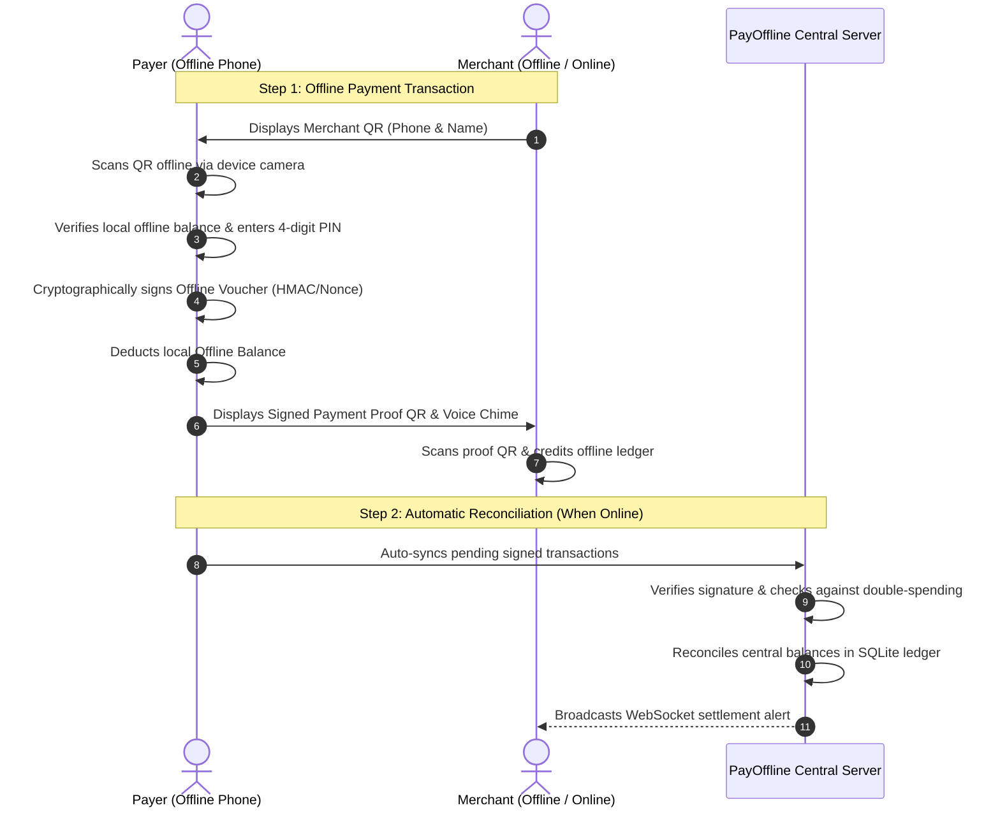

# ⚡ PayOffline - Offline QR Code & Digital Cash System

An enterprise-grade, offline-first Progressive Web Application (PWA) and backend system that allows users and merchants to scan QR codes and securely send money without requiring an internet connection. Includes mobile phone verification, real notifications, cryptographic anti-tamper signing, and automated reconciliation.

---

## 🌟 Key Capabilities

1. **100% Offline QR Payments**:
   - **Scan Merchant QR Offline**: Payer scans merchant's dynamic/static QR code without internet, inputs PIN, and creates a cryptographically signed offline voucher.
   - **Pay via Signed Offline Voucher**: Payer creates a signed single-use QR token from their offline balance; merchant scans it to instantly collect offline funds.
   - **Anti-Replay & Double-Spending Protection**: Cryptographic HMAC-SHA256 signatures, monotonic counters, and single-use nonces ensure that offline tokens cannot be duplicated or spent twice.

2. **Mobile Login & Real Notification Verification**:
   - Real mobile number login with standard international phone formatting.
   - Dispatches a 6-digit verification code with 5-minute security timeout.
   - **Multi-channel real notification delivery**:
     - **Web / System Push Notification**: Pops up native system notification banners on Android, iOS, Windows, and Mac.
     - **Real SMS Gateway Integration**: Pre-configured support for Twilio and Fast2SMS. Add your API credentials in `.env` for cellular SMS.
     - **In-App FinTech Notification Toast**: Interactive toast with audio chime and one-click auto-fill.

3. **Dual Pocket Architecture (CBDC / UPI Lite Model)**:
   - **Online Bank Vault**: Central reserves for online transactions and banking top-ups.
   - **Offline Pocket Cash**: Pre-allocated balance stored securely on the local device, available for instant zero-latency transactions even in flight/airplane mode or remote areas with no cellular network.

4. **FinTech Soundbox & Tactile Feedback**:
   - Built-in Web Audio API soundbox synthesizes incoming notification chimes, camera scan chirps, and cash register fanfare.
   - Native Text-to-Speech (TTS) voice announcements (e.g. *"Offline payment of ₹50 sent to Sharma General Store"*).
   - Vibration haptic feedback on camera QR detection.

5. **Offline-First PWA (Progressive Web App)**:
   - Full Service Worker (`sw.js`) cache preloads all shell assets.
   - Camera QR scanner (`html5-qrcode`) and QR generator (`qrcode.js`) operate client-side with zero external CDN dependencies.
   - Installable on mobile home screens (Android / iOS) as a standalone app.

6. **Automatic Reconciliation Engine**:
   - Offline transactions are tagged `OFFLINE_PENDING`.
   - As soon as either party reconnects to the network, transactions automatically sync and settle against the central SQLite ledger via WebSockets and REST APIs.

---

## 🏗️ System Architecture



---

## 🚀 Quick Start (Running Locally)

### 1. Prerequisites
- Node.js (v18, v20, v22, or v24)
- npm (installed with Node)

### 2. Start the Server
```bash
# Start server
npm start
```
The application will launch on:
👉 **`http://localhost:3000`**

### 3. Run Automated End-to-End Test Suite
To verify the entire cryptographic pipeline and all API endpoints:
```bash
node server/test_e2e.js
```

---

## 📱 Mobile Verification & SMS Configuration

By default, the system runs with active browser push notifications, interactive soundbox alerts, and mock OTPs (`123456` or dynamic codes).

To send **real cellular SMS messages** to physical mobile phones:
Open `.env` and fill in your Twilio or Fast2SMS API credentials:

```ini
PORT=3000
NODE_ENV=production
JWT_SECRET=your-secure-jwt-secret-key-2026

# Twilio SMS Gateway (Global)
TWILIO_ACCOUNT_SID=ACXXXXXXXXXXXXXXXXXXXXXXXXXXXXXXXX
TWILIO_AUTH_TOKEN=your_auth_token_here
TWILIO_PHONE_NUMBER=+1234567890

# Or Fast2SMS (India)
FAST2SMS_API_KEY=your_fast2sms_key_here
```

---

## 🌐 Permanent Cloud Deployment Options

### Option 1: Docker & Docker Compose (Recommended for Any VPS / Cloud Server)

This repository includes a production-ready `Dockerfile` and `docker-compose.yml` with persistent database volumes.

```bash
# Build and run container in detached mode
docker compose up -d --build
```
Your database will persist in `./server/data/offline_pay.sqlite` across container restarts.

---

### Option 2: Render (1-Click Free / Managed Deployment)

1. Push this project to a GitHub repository.
2. Sign up on [Render.com](https://render.com).
3. Click **New +** -> **Web Service** -> Connect your GitHub repo.
4. Render will automatically detect `render.yaml`:
   - **Environment**: Node
   - **Build Command**: `npm install`
   - **Start Command**: `npm start`
5. Click **Create Web Service**. Your app is permanently live with a free HTTPS URL!

---

### Option 3: Railway / Fly.io / Heroku

- **Railway**: Click **New Project** -> Deploy from GitHub. Railway automatically recognizes `Dockerfile`.
- **Fly.io**:
  ```bash
  fly launch
  fly deploy
  ```

---

## 🔒 Security Best Practices Implemented

- **No Double-Spending**: Transactions contain monotonic counters and random nonces that prevent replay attacks.
- **Client-Side Key Enclave**: Device secrets are generated using high-entropy CSPRNG (`window.crypto.getRandomValues`) and stored in local client storage.
- **Offline Integrity Checksum**: Every payment payload contains a strict canonical format representation signed before deduction.
- **Rate-Limited OTPs**: Verification codes expire after 300 seconds (5 minutes) and are invalidated immediately upon use.
